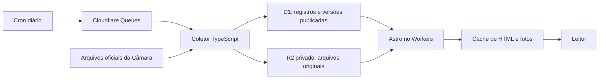

# Lume

**A vida pública, às claras.**

Perfis dos deputados federais em exercício por São Paulo, com votos nominais, despesas da cota e proposições. Interface em português, temas claro/escuro, fontes oficiais e cobertura explícita.

## Dados disponíveis

A carga inicial, consultada em **5 de outubro de 2026**, contém 70 perfis oficiais. No recorte abril–setembro de 2026 há 8.423 lançamentos de despesas, 3.785 votos individuais e 4.049 vínculos de autoria ou coautoria. Vínculos de autoria não são contagem de projetos distintos.

- Cadastro: serviço público de deputados em exercício da Câmara.
- Despesas: arquivo anual da CEAP, valor líquido por competência, incluindo estornos.
- Votos: votos nominais ligados ao registro da votação; Plenário e comissões. Não mede presença.
- Proposições: autoria e coautoria, filtradas pela data de apresentação.
- **Emendas: ainda não integradas.** A interface mostra a indisponibilidade, sem inventar valores.

As datas de coleta aparecem por seção. A fonte pode receber retificações posteriores. Filiação partidária e situação vêm do cadastro atual. O Lume é independente da Câmara e não produz notas ou rankings políticos.

## Arquitetura



O site consulta o D1, sem chamar APIs governamentais a cada visita. O coletor publica uma versão apenas depois de validar o arquivo completo; falhas preservam a versão anterior. O D1 mantém os registros publicados, enquanto os originais ficam no R2. As filas têm tentativas limitadas e fila de falhas.

O coletor usa Workers Paid, com limite de CPU configurado. D1, R2 e Queues possuem limites e cobrança próprios: consulte os preços antes de implantar. O recorte nacional do DOU, Senado e classificação com Jev são evolução futura, não funcionalidades desta versão.

## Desenvolvimento

Requer Node.js 22.12+ e npm.

```sh
npm ci
npm run cf:types
npm run db:migrate
npm run dev
```

Abra `http://127.0.0.1:4173`. O D1 local começa vazio; nenhum dado de demonstração é servido em produção. Para testar com os dados oficiais, siga [a operação e importação](docs/operacao.md).

```sh
npm run check
npm test
npm run build
```

Os testes unitários usam amostras sintéticas explícitas. Os testes de navegação exigem a carga oficial no D1 local:

```sh
npx playwright install chromium
npm run test:e2e
```

A prévia de testes usa a porta 4174. `PLAYWRIGHT_CHROME=1` seleciona o Chrome instalado.

## Implantação

O projeto usa **Cloudflare Workers**, D1, R2 e Queues. Ajuste as contas e os identificadores em `wrangler.jsonc` e `workers/collector/wrangler.jsonc` para a sua infraestrutura. Identificadores não são credenciais. Nunca versionar tokens ou arquivos `.dev.vars`.

```sh
npx wrangler login
npx wrangler d1 migrations apply lume-db --remote
npm run deploy
npx wrangler deploy -c workers/collector/wrangler.jsonc
```

A configuração agenda a coleta às 06:00 UTC. As fotos da carga inicial estão no R2; atualização automática de retratos é uma pendência descrita na operação. `/api/health` informa a versão do site e as datas dos conjuntos publicados.

## Contribuir

Mudanças de dados devem preservar IDs oficiais, fontes, datas de coleta, competência financeira e valores desconhecidos. Nunca inferir ausência a partir de um voto faltante. Teste normalizadores com casos incompletos e confira alterações visuais em telas pequenas.

- [Operação e fontes](docs/operacao.md)
- [Direção do produto](docs/proposta.md)
- [Assets e atribuição](docs/assets.md)

Código: **Apache-2.0**. Dados, retratos e fontes têm origem e condições próprias; consulte a atribuição.
